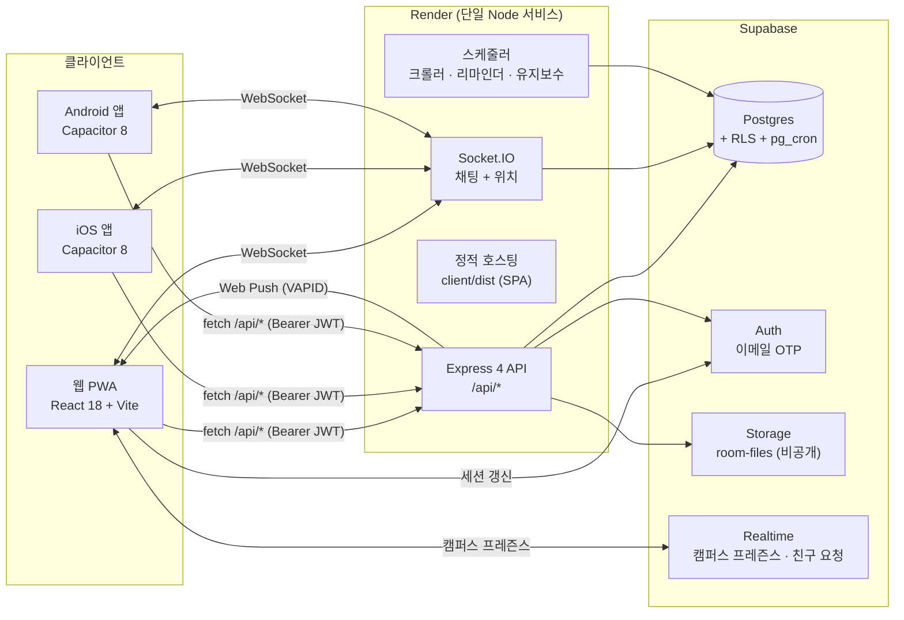
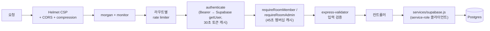
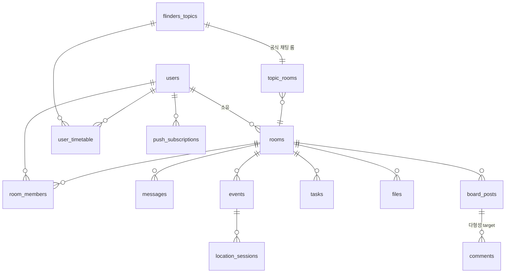

# 아키텍처 — Flinders Collab

> English version: [ARCHITECTURE.md](./ARCHITECTURE.md)

Flinders Collab은 플린더스 대학교 학생들을 위한 풀스택 협업 플랫폼입니다: 팀 룸, 실시간 채팅, 시간표 공유, 과제(태스크), 실시간 위치 공유가 붙은 이벤트, 파일 공유, 푸시 알림을 제공합니다. **하나의 React 코드베이스**가 웹 PWA, iOS 앱, Android 앱으로 배포되고(Capacitor), 백엔드는 단일 **Express + Socket.IO** API와 **Supabase**(Postgres, Auth, Storage, Realtime)로 구성됩니다.

이 문서는 시스템이 어떻게 구성되어 있는지와 함께, **왜 이렇게 설계했는지**를 설명합니다.

- [시스템 개요](#시스템-개요)
- [저장소 구조](#저장소-구조)
- [프론트엔드](#프론트엔드)
- [백엔드](#백엔드)
- [실시간 레이어](#실시간-레이어)
- [데이터 모델](#데이터-모델)
- [인증 & 보안](#인증--보안)
- [백그라운드 작업](#백그라운드-작업)
- [배포](#배포)
- [설계 결정과 트레이드오프](#설계-결정과-트레이드오프)

## 시스템 개요



핵심 아이디어: **모든 읽기/쓰기는 Express API를 통과**하며, API는 service-role 클라이언트로 Supabase에 접근하면서 인가(authorization)를 한곳(미들웨어 + 컨트롤러)에서 처리합니다. 클라이언트가 Supabase를 직접 쓰는 것은 인증 세션 수명주기와 두 개의 Realtime 채널뿐이며, 임의의 테이블 접근은 절대 하지 않습니다.

## 저장소 구조

| 경로 | 역할 |
|---|---|
| `client/` | **주력 프론트엔드.** React 18 + Vite + Tailwind + Radix UI. 같은 코드베이스에서 생성된 Capacitor `ios/`, `android/` 네이티브 프로젝트 포함. |
| `server/` | **백엔드.** Express 4 + Socket.IO. `routes/ → controllers/ → services/` 레이어 구조 + 공통 `middleware/`. |
| `supabase/` | **스키마.** 번호가 매겨진 SQL 마이그레이션 13개, `seed.sql`, `reset_app_data.sql`. |
| `mobile/` | 초기 단계의 Expo / React Native 클라이언트(인증 화면 동작, 메인 화면은 스텁). 기술 탐색용으로 유지 — 실제 배포되는 모바일 앱은 `client/`의 Capacitor 빌드입니다. |
| `docs/` | 배포 가이드, QA 체크리스트, 엔지니어링 노트. |
| `render.yaml` | Render 배포 설정(단일 웹 서비스). |
| `package.json` | npm workspaces 래퍼: `build`는 클라이언트 빌드, `start`는 서버 실행. |

## 프론트엔드

**스택:** React 18, Vite 6, Tailwind CSS, Radix UI, zustand(상태 관리), react-router-dom v6, socket.io-client, `@supabase/supabase-js`, Leaflet(캠퍼스 지도), qrcode.react.

**레이어 구조** (`client/src/`):

- `pages/` — 라우트당 하나의 컴포넌트: Dashboard, Room, Messages, Board, Timetable, Deadlines, FlindersLife, FlindersSocial, Admin, Settings, Login, Signup, ResetPassword.
- `components/` — 도메인 컴포넌트(auth, chat, room, schedule, files, location, settings)와 `ui/` Radix 래퍼, 온보딩 투어(`OnboardingTour.jsx`, `PageTour.jsx`), PWA `InstallBanner`(휴대폰에서 설치 페이지로 안내하는 QR 코드).
- `services/` — 백엔드 도메인별 fetch 래퍼 12개(`rooms.js`, `chat.js`, `auth.js`, `files.js`, …). 컴포넌트는 절대 `fetch`를 직접 호출하지 않고 모든 네트워크 호출이 이 레이어를 거치므로, 인증 헤더·베이스 URL·에러 처리가 한곳에 모입니다.
- `store/` — 세션과 앱 상태를 담는 zustand 스토어.
- `layouts/`, `hooks/`, `lib/` — 셸 레이아웃, 공용 훅, 설정/유틸리티.

**PWA:** 플러그인 대신 직접 작성한 서비스 워커(`client/public/sw.js`)와 `manifest.json` — 의도적으로 작고 디버깅하기 쉽게 유지했습니다. 서버는 `sw.js`, `manifest.json`, `index.html`을 no-cache 헤더로 서빙해서 PWA 업데이트가 즉시 반영되게 하고, 해시가 붙은 빌드 자산은 일반적으로 캐시합니다.

**네이티브 앱:** Capacitor 8이 빌드된 웹 앱을 실제 Xcode / Android Studio 프로젝트로 감싸고, geolocation·haptics·keyboard·status bar·splash screen·clipboard 네이티브 플러그인을 사용합니다. `npm run ios:prepare` / `android:prepare`가 웹 번들을 빌드해서 네이티브 셸에 동기화합니다.

## 백엔드

**스택:** Node 20+, Express 4, Socket.IO 4, `@supabase/supabase-js`(데이터 + 인증), `pg`(부팅 마이그레이터 전용), Helmet, express-rate-limit, express-validator, multer, web-push.

**요청 수명주기:**



**레이어 구조** (`server/src/`): 라우트 파일 15개가 엔드포인트를 정의하고 미들웨어를 연결하며, 도메인별 컨트롤러 13개(auth, rooms, messages, events, tasks, files, board, announcements, timetable, location, push, reports, activity)가 비즈니스 로직을 담당하고, `services/supabase.js`가 데이터베이스 클라이언트를 중앙화합니다. 도메인 라우트는 `/api/auth`, `/api/rooms`, `/api/timetable`, `/api/admin`, `/api/push`에 마운트되고, 나머지 리소스 라우트는 `/api`에 마운트됩니다.

**세 개의 Supabase 클라이언트, 세 단계의 신뢰 수준** (`server/src/services/supabase.js`):

| 클라이언트 | 키 | RLS | 용도 |
|---|---|---|---|
| `supabaseAdmin` | service role | 우회 | API가 호출자를 직접 검증한 뒤의 서버 사이드 작업 |
| `supabasePublic` | anon | 적용 | 사용자가 존재하기 전의 OTP 발송/검증 플로우 |
| `createUserClient(token)` | anon + 사용자 JWT | 적용 | 사용자 권한으로 실행해야 하는 요청 단위 작업 |

프로덕션에서는 같은 Express 프로세스가 빌드된 SPA(`client/dist`)도 서빙하며, `/api`가 아닌 모든 경로에 SPA 폴백을 적용합니다. 클라이언트와 API가 same-origin이라 CORS, 쿠키, WebSocket 연결 처리가 단순해집니다.

## 실시간 레이어

Socket.IO가 채팅과 실시간 위치를 담당합니다. WebSocket은 핸드셰이크 시점에 인증됩니다: 미들웨어가 어떤 이벤트 핸들러보다 먼저 Supabase JWT를 검증하고, 각 소켓은 개인 지정 전송용 `user:{id}` 룸에 조인합니다.

```mermaid
sequenceDiagram
    participant C as 클라이언트
    participant S as Socket.IO 서버
    participant DB as Postgres
    participant P as Web Push

    C->>S: 연결 (핸드셰이크에 JWT)
    S->>S: Supabase로 토큰 검증, user:{id} 조인
    C->>S: chat:join { roomId }
    S->>DB: room_members 검증<br/>(60초 캐시; user_timetable 기반<br/>토픽 룸 자동 조인)
    S-->>C: room:{roomId} 조인 완료
    C->>S: chat:message
    S->>DB: INSERT INTO messages
    S-->>C: room:{roomId}에 브로드캐스트
    S->>P: notifyRoom → 오프라인 멤버에게 푸시
```

주목할 만한 두 가지:

- **토픽 룸 자동 조인:** 사용자가 수강 중인 과목의 채팅을 열면 핸들러가 `topic_rooms`로 공식 공유 룸을 찾아 `user_timetable`을 확인합니다 — 수강 등록이 곧 멤버십이므로, 학생들이 수업 채팅방 초대를 따로 관리할 필요가 없습니다.
- **프레즌스 정리:** 연결이 끊기면 서버는 해당 사용자의 다른 활성 소켓이 없을 때 `location_sessions`를 stopped로 표시해서, "위치 공유 중" 상태가 낡은 채로 남지 않게 합니다.

별도로, 쓰기 빈도가 낮은 두 기능(캠퍼스 프레즌스, 친구 요청)은 Socket.IO 대신 클라이언트에서 직접 **Supabase Realtime** 구독을 사용합니다 — 브로드캐스트 성격이고 이벤트마다 서버 로직이 필요 없기 때문입니다.

## 데이터 모델

스키마는 `supabase/migrations/`(번호가 매겨진 파일 13개: 초기 스키마 → RLS 수정 → 태스크 → 관리자/신고 → 게시판/댓글 → 프로필 정규화 → 푸시 → Pro 기능 → 시간표)에 있습니다. 추가로 `server/src/utils/migrate.js`가 부팅할 때마다 멱등(idempotent) DDL을 실행합니다([트레이드오프](#설계-결정과-트레이드오프) 참고).

핵심 관계(총 약 28개 테이블 중 중심부):



- **`rooms`**가 집합체 루트(aggregate root)입니다: 멤버십(`room_members`, owner/admin/member 역할, 사용자+룸별 유니크), 채팅, 이벤트, 태스크, 파일, 공지, 게시판 콘텐츠가 모두 여기에 매달립니다.
- **`flinders_topics`**는 크롤링한 대학 과목 데이터를 저장합니다(개설 정보는 JSONB, 학기/캠퍼스는 배열). `user_timetable`이 학생의 수강 정보를 자동 생성된 룸과 연결하고, `topic_rooms`가 각 과목을 하나의 공식 채팅 룸에 매핑합니다.
- **`location_sessions`**는 (이벤트, 사용자)별 유니크이며 상태 머신을 가집니다: `sharing → on_the_way → arrived / late → stopped`.
- **`comments`**는 다형성(`target_type` + `target_id`) 구조라 하나의 댓글 시스템이 게시판과 향후 다른 대상까지 처리합니다.
- **pg_cron**을 통한 Postgres 수준 자동화: 3시간마다 오래된 캠퍼스 프레즌스 숨김, 매일 중단된 위치 세션 정리, 매주 오래된 캐시 이벤트 삭제.

## 인증 & 보안

**회원가입은 이메일 OTP 기반**이며 대학 이메일로 제한됩니다:

1. `POST /api/auth/verify-email/send` — Supabase가 OTP를 발송(재발송 쿨다운 60초).
2. `POST /api/auth/verify-email/confirm` — 코드 검증; **5회 실패 시 30분 잠금**(`authController.js`의 인메모리 시도 횟수 맵).
3. `POST /api/auth/complete-signup` — 인증이 완료된 사용자의 `users` 프로필 행 생성.

비밀번호 재설정 코드에도 동일한 잠금 정책이 적용됩니다. 게스트/테스터 계정은 플래그(`ALLOW_TESTER_MODE`) 뒤에 있으며 별도의 rate limit과 정리(cleanup) 엔드포인트를 갖습니다.

계층별 심층 방어(defense in depth):

| 계층 | 메커니즘 |
|---|---|
| 전송 / 헤더 | 커스텀 CSP를 적용한 Helmet(`*.supabase.co` + `wss://*.supabase.co`만 허용), 설정된 origin으로 제한된 CORS, Render 뒤에서 올바른 클라이언트 IP를 얻기 위한 `trust proxy` |
| Rate limiting | 라우트별 `express-rate-limit`: 로그인/가입, 게스트 생성, 룸 조인 — 가입은 이메일 기준이라 한 IP로 계정을 대량 생성할 수 없음 |
| 입력 | 모든 라우트에 `express-validator` 체인 + 공용 밸리데이터 |
| 인증 | 요청마다 Supabase로 Bearer JWT 검증, 인증 왕복을 줄이기 위한 30초 인메모리 캐시 |
| 인가 | `room_members` 기반 `requireRoomMember` / `requireRoomAdmin` 미들웨어(45초 캐시) |
| 데이터베이스 | **모든 핵심 테이블에 RLS 활성화** + 테이블별 정책, 전용 마이그레이션으로 강화 — API가 1차 관문이지만 RLS가 2차 방어벽 |
| Storage | 비공개 `room-files` 버킷, 소유자 범위 삭제, MIME 허용 목록, multer로 50MB 상한 |
| 시크릿 | 전부 환경 변수; VAPID 개인 키와 service-role 키는 서버 밖으로 나가지 않음; `.env`는 gitignore 처리 |

## 백그라운드 작업

서버 프로세스는 API와 함께 여러 스케줄러를 실행합니다(부팅 마이그레이션 후 `index.js`에서 시작):

- **이벤트 크롤러 / 과목 크롤러** — 플린더스 이벤트와 과목 카탈로그 데이터를 주기적으로 `flinders_events_cache` / `flinders_topics`에 수집해, 런타임 스크래핑 없이 시간표와 FlindersLife 기능을 지원합니다.
- **마감 리마인더 스케줄러** — 다가오는 마감일을 Web Push 알림으로 변환합니다.
- **유지보수 + 헬스 체크** — 주기적 정리와 모니터링.
- **Keep-alive 셀프 핑** — 프로덕션에서 14분마다 `/api/health`를 호출해 Render 무료 티어가 서비스를 잠재우지 않게 합니다.

## 배포

Render 웹 서비스 하나(싱가포르 리전)가 전부를 실행합니다:

```
build:  npm install --include=dev && npm run build   # client/dist 빌드
start:  npm start                                    # server/src/index.js 실행
```

부팅 시 서버가 `migrate.js`(멱등 DDL, `DATABASE_URL` 대상)를 실행한 뒤 스케줄러를 시작하고 `/api/*`와 정적 SPA를 함께 서빙합니다. 헬스 체크는 `/api/health`. 모든 시크릿(`SUPABASE_*`, `JWT_SECRET`, `VAPID_*`, `CLIENT_URL`, `DATABASE_URL`)은 Render의 비동기화(non-synced) 환경 변수로 설정됩니다.

`main`에 푸시하면 배포가 트리거되고, Supabase(Postgres/Auth/Storage/Realtime)는 완전 관리형이라 별도로 운영할 인프라가 없습니다.

## 설계 결정과 트레이드오프

**Supabase 직접 접근 대신 자체 API.** 클라이언트가 PostgREST에 직접 접근할 수도 있었지만, 채팅 때문에 상태를 가진 WebSocket 서버가 어차피 필요했고, 쓰기를 Express 뒤로 모으면 검증·rate limiting·푸시 사이드이펙트·다중 테이블 로직(예: 초대 코드 조인이 멤버십 생성 *그리고* 시스템 메시지 *그리고* 푸시를 한 번에 처리)을 한곳에서 다룰 수 있습니다. RLS는 유일한 방어벽이 아니라 2차 방어벽으로 유지됩니다.

**프론트/백엔드 분리 배포 대신 단일 웹 서비스.** Same-origin 서빙은 CORS/쿠키 복잡성을 없애고 호스팅 비용을 절반으로 줄입니다. 프론트엔드만 바뀌어도 서버가 재배포된다는 트레이드오프는 현재 규모에서 수용 가능합니다.

**모바일 배포는 React Native/Flutter 대신 Capacitor.** 하나의 React 코드베이스로 웹 + iOS + Android를 완전한 기능 동등성으로 배포할 수 있다는 점이, 채팅/조율 앱에서는 네이티브 렌더링 감성보다 중요했습니다. `mobile/`(Expo) 디렉터리는 네이티브 우선 대안을 탐색한 기록으로 남겨두었고, 반복 개발 속도에서 Capacitor가 이겼습니다.

**이중 스키마 소스(번호 마이그레이션 + 부팅 시 `migrate.js`).** 번호가 매겨진 SQL 파일은 리뷰된 이력이고, 멱등 부팅 마이그레이터는 수동 마이그레이션 없이 어떤 환경이든 동작하는 스키마로 수렴하게 보장합니다 — 새 Supabase 프로젝트에 배포할 때 특히 유용합니다. 비용은 전체 스키마를 파악하려면 두 곳을 봐야 한다는 것이며, 런타임 기준의 진실 소스는 부팅 마이그레이터입니다.

**인메모리 캐시와 rate-limit 상태.** 토큰(30초), 멤버십(45–60초), OTP 시도 상태는 Redis가 아니라 프로세스 메모리에 있습니다. 단일 인스턴스에서는 정확하고, 의도적인 선택입니다: 현재 규모에서는 Redis의 운영 비용이 이점보다 큽니다. 다중 인스턴스로 확장하면 공유 저장소로 옮기게 되는데, 캐시 로직이 이미 작은 헬퍼 뒤에 격리되어 있어 교체 범위가 국소적입니다.

**직접 작성한 서비스 워커.** 설치 가능성과 즉각적인 업데이트 반영이 주 요구사항인 PWA에서는(그래서 `sw.js`/`index.html`에 no-cache 헤더), 완전히 이해하고 있는 수십 줄짜리 워커가 생성된 워커보다 낫습니다.
