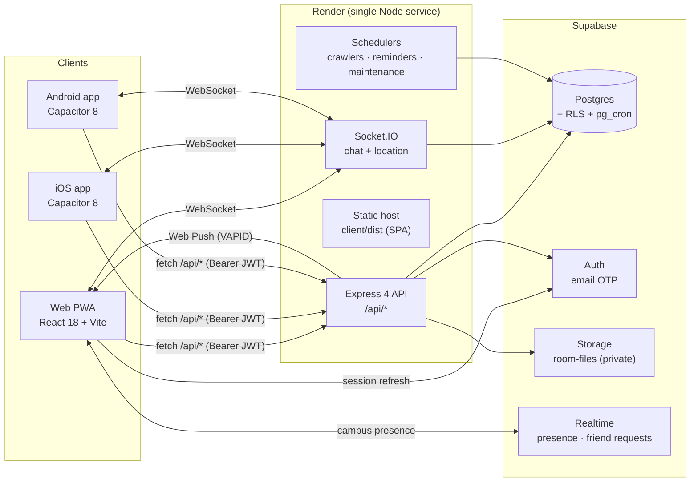
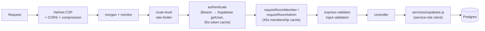
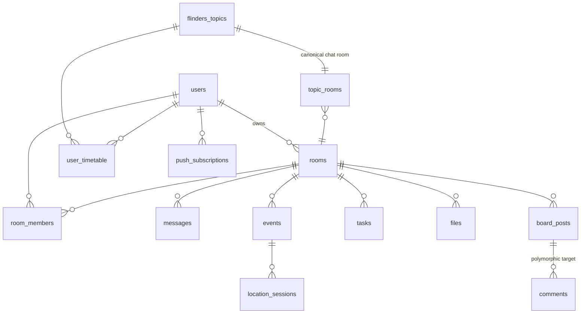

# Architecture — Flinders Collab

> 한국어 버전: [ARCHITECTURE.ko.md](./ARCHITECTURE.ko.md)

Flinders Collab is a full-stack collaboration platform for Flinders University students: team rooms, real-time chat, shared timetables, tasks, events with live location, file sharing, and push notifications. One React codebase ships as a **web PWA, iOS app, and Android app** (via Capacitor), backed by a single **Express + Socket.IO** API and **Supabase** (Postgres, Auth, Storage, Realtime).

This document explains how the system is put together and, just as importantly, **why** it is put together this way.

- [System overview](#system-overview)
- [Repository layout](#repository-layout)
- [Frontend](#frontend)
- [Backend](#backend)
- [Real-time layer](#real-time-layer)
- [Data model](#data-model)
- [Auth & security](#auth--security)
- [Background jobs](#background-jobs)
- [Deployment](#deployment)
- [Design decisions & trade-offs](#design-decisions--trade-offs)

## System overview



Key idea: **all reads and writes go through the Express API**, which talks to Supabase with a service-role client and enforces authorization in one place (middleware + controllers). Supabase is used directly from the client only for the auth session lifecycle and two Realtime channels — never for arbitrary table access.

## Repository layout

| Path | Role |
|---|---|
| `client/` | **Primary frontend.** React 18 + Vite + Tailwind + Radix UI. Also contains the Capacitor `ios/` and `android/` native projects generated from the same codebase. |
| `server/` | **Backend.** Express 4 + Socket.IO. Layered as `routes/ → controllers/ → services/` with cross-cutting `middleware/`. |
| `supabase/` | **Schema.** 13 numbered SQL migrations, `seed.sql`, `reset_app_data.sql`. |
| `mobile/` | Early-stage Expo / React Native client (auth screens working, main screens stubbed). Kept as an exploration; the shipped mobile apps come from `client/` via Capacitor. |
| `flutter_app/` | Experimental Flutter companion client. |
| `docs/` | Deployment guides, QA checklists, engineering notes. |
| `render.yaml` | Render deployment config (single web service). |
| `package.json` | npm workspaces wrapper: `build` builds the client, `start` runs the server. |

## Frontend

**Stack:** React 18, Vite 6, Tailwind CSS, Radix UI primitives, zustand for state, react-router-dom v6, socket.io-client, `@supabase/supabase-js`, Leaflet (campus maps), qrcode.react.

**Layering** (`client/src/`):

- `pages/` — one component per route: Dashboard, Room, Messages, Board, Timetable, Deadlines, FlindersLife, FlindersSocial, Admin, Settings, Login, Signup, ResetPassword.
- `components/` — domain components (auth, chat, room, schedule, files, location, settings) plus `ui/` Radix wrappers, onboarding tours (`OnboardingTour.jsx`, `PageTour.jsx`), and the PWA `InstallBanner` (QR code that points phones at the install page).
- `services/` — 12 thin fetch wrappers (`rooms.js`, `chat.js`, `auth.js`, `files.js`, …), one per backend domain. Components never call `fetch` directly; every network call goes through this layer, so auth headers, base URLs, and error handling live in one place.
- `store/` — zustand stores for session and app state.
- `layouts/`, `hooks/`, `lib/` — shell layout, shared hooks, config/utilities.

**PWA:** hand-rolled service worker (`client/public/sw.js`) and `manifest.json` rather than a plugin — kept deliberately small and debuggable. The server serves `sw.js`, `manifest.json`, and `index.html` with no-cache headers so PWA updates propagate immediately, while hashed build assets are cached normally.

**Native apps:** Capacitor 8 wraps the built web app into real Xcode / Android Studio projects, with native plugins for geolocation, haptics, keyboard, status bar, splash screen, and clipboard. `npm run ios:prepare` / `android:prepare` builds the web bundle and syncs it into the native shells.

## Backend

**Stack:** Node 20+, Express 4, Socket.IO 4, `@supabase/supabase-js` (data + auth), `pg` (used only by the startup migrator), Helmet, express-rate-limit, express-validator, multer, web-push.

**Request lifecycle:**



**Layering** (`server/src/`): 15 route files define endpoints and attach middleware; 13 controllers (one per domain: auth, rooms, messages, events, tasks, files, board, announcements, timetable, location, push, reports, activity) hold the business logic; `services/supabase.js` centralizes database clients. Domain routes mount under `/api/auth`, `/api/rooms`, `/api/timetable`, `/api/admin`, `/api/push`, with the remaining resource routes mounted on `/api`.

**Three Supabase clients, three trust levels** (`server/src/services/supabase.js`):

| Client | Key | RLS | Used for |
|---|---|---|---|
| `supabaseAdmin` | service role | bypassed | server-side operations after the API has verified the caller itself |
| `supabasePublic` | anon | enforced | OTP send/verify flows before a user exists |
| `createUserClient(token)` | anon + user JWT | enforced | per-request operations that should run as the user |

In production the same Express process also serves the built SPA (`client/dist`) with an SPA fallback for all non-`/api` paths — client and API are same-origin, which simplifies CORS, cookies, and WebSocket connection handling.

## Real-time layer

Socket.IO handles chat and live location. The WebSocket is authenticated at the handshake: the middleware verifies the Supabase JWT before any event handler runs, and each socket joins a private `user:{id}` room for targeted delivery.

```mermaid
sequenceDiagram
    participant C as Client
    participant S as Socket.IO server
    participant DB as Postgres
    participant P as Web Push

    C->>S: connect (JWT in handshake)
    S->>S: verify token via Supabase, join user:{id}
    C->>S: chat:join { roomId }
    S->>DB: verify room_members<br/>(60s cache; auto-join topic rooms<br/>via user_timetable)
    S-->>C: joined room:{roomId}
    C->>S: chat:message
    S->>DB: INSERT INTO messages
    S-->>C: broadcast to room:{roomId}
    S->>P: notifyRoom → push offline members
```

Two details worth noting:

- **Topic-room auto-join:** if a user opens the chat for one of their enrolled topics, the handler resolves the canonical shared room via `topic_rooms` and checks `user_timetable` — enrollment *is* membership, so students never manage invites for class chats.
- **Presence cleanup:** on disconnect, the server marks the user's `location_sessions` as stopped if they have no other live sockets, so stale "sharing location" states cannot linger.

Separately, two low-write features (campus presence, friend requests) use **Supabase Realtime** subscriptions directly from the client instead of Socket.IO — they are broadcast-shaped and need no server-side logic per event.

## Data model

Schema lives in `supabase/migrations/` (13 numbered files: initial schema → RLS fixes → tasks → admin/reports → board/comments → profile normalization → push → pro features → timetable). In addition, `server/src/utils/migrate.js` runs idempotent DDL on every boot (see [trade-offs](#design-decisions--trade-offs)).

Core relationships (~28 tables total; the heart of it):



- **`rooms`** is the aggregate root: membership (`room_members` with owner/admin/member roles, unique per user+room), chat, events, tasks, files, announcements, and board content all hang off it.
- **`flinders_topics`** stores crawled university topic data (offerings as JSONB, semesters/campuses as arrays); `user_timetable` links a student's enrollment to an auto-created room, and `topic_rooms` maps each topic to its one canonical chat room.
- **`location_sessions`** is unique per (event, user) with a status machine: `sharing → on_the_way → arrived / late → stopped`.
- **`comments`** is polymorphic (`target_type` + `target_id`) so one comment system serves boards and future targets.
- Postgres-level automation via **pg_cron**: hide stale campus presence every 3 h, purge stopped location sessions daily, evict old cached events weekly.

## Auth & security

**Signup is email-OTP based**, restricted to university emails:

1. `POST /api/auth/verify-email/send` — Supabase sends an OTP (60 s resend cooldown).
2. `POST /api/auth/verify-email/confirm` — verifies the code; **5 failed attempts locks the flow for 30 minutes** (in-memory attempt map in `authController.js`).
3. `POST /api/auth/complete-signup` — creates the `users` profile row for the now-authenticated user.

The same lockout policy protects password-reset codes. Guest/tester accounts exist behind a flag (`ALLOW_TESTER_MODE`) with their own rate limit and a cleanup endpoint.

Defense in depth, in layers:

| Layer | Mechanism |
|---|---|
| Transport / headers | Helmet with a custom CSP (allows only `*.supabase.co` + `wss://*.supabase.co`), CORS restricted to configured origins, `trust proxy` for correct client IPs behind Render |
| Rate limiting | per-route `express-rate-limit`: login/signup, guest creation, room joins — signup keyed by email so one IP can't spray accounts |
| Input | `express-validator` chains on every route + shared validators |
| Authentication | Bearer JWT verified against Supabase per request, with a 30 s in-memory cache to cut auth round-trips |
| Authorization | `requireRoomMember` / `requireRoomAdmin` middleware backed by `room_members` (45 s cache) |
| Database | **RLS enabled on all core tables** with per-table policies, hardened in dedicated migrations — a second wall even though the API is the primary gatekeeper |
| Storage | private `room-files` bucket, owner-scoped deletes, MIME allow-list, 50 MB cap via multer |
| Secrets | everything in env vars; VAPID private key and service-role key never leave the server; `.env` gitignored |

## Background jobs

The server process runs several schedulers alongside the API (started in `index.js` after the boot migration):

- **Event crawler / topic crawler** — periodically ingest Flinders events and topic-catalog data into `flinders_events_cache` / `flinders_topics`, powering the timetable and FlindersLife features without runtime scraping.
- **Deadline reminder scheduler** — turns upcoming due dates into Web Push notifications.
- **Maintenance + health checks** — periodic cleanup and monitoring.
- **Keep-alive self-ping** — hits `/api/health` every 14 minutes in production so Render's free tier never idles the service.

## Deployment

One Render web service (Singapore region) runs everything:

```
build:  npm install --include=dev && npm run build   # builds client/dist
start:  npm start                                    # runs server/src/index.js
```

On boot the server runs `migrate.js` (idempotent DDL against `DATABASE_URL`), then starts schedulers and begins serving both `/api/*` and the static SPA. Health checks hit `/api/health`. All secrets (`SUPABASE_*`, `JWT_SECRET`, `VAPID_*`, `CLIENT_URL`, `DATABASE_URL`) are configured as non-synced env vars in Render.

Pushing to `main` triggers a deploy; Supabase (Postgres/Auth/Storage/Realtime) is fully managed, so there is no other infrastructure to operate.

## Design decisions & trade-offs

**Own API over direct Supabase access.** The client could talk to PostgREST directly, but chat needed a stateful WebSocket server anyway, and centralizing writes behind Express gives one place for validation, rate limiting, push side-effects, and multi-table logic (e.g., join-by-invite-code creating a membership *and* a system message *and* a push). RLS stays on as the second wall rather than the only wall.

**One web service instead of separate frontend/backend deploys.** Same-origin serving removes CORS/cookie complexity and halves hosting cost. The trade-off — a frontend-only change redeploys the server — is acceptable at this scale.

**Capacitor over React Native/Flutter for shipping mobile.** One React codebase produces web + iOS + Android with full feature parity, which mattered more than native-feel rendering for a chat/coordination app. The `mobile/` (Expo) and `flutter_app/` directories are retained explorations of the native-first alternative; Capacitor won on iteration speed.

**Dual schema source (numbered migrations + boot-time `migrate.js`).** Numbered SQL files are the reviewed history; the idempotent boot migrator guarantees any environment converges to a working schema without a manual migration step — valuable when deploying to fresh Supabase projects. The cost is two places to read for the full schema; the boot migrator is the runtime source of truth.

**In-memory caches and rate-limit state.** Token (30 s), membership (45–60 s), and OTP-attempt state live in process memory instead of Redis. Correct on a single instance, and chosen deliberately: at current scale the operational cost of Redis outweighs its benefit. Scaling to multiple instances would move these to a shared store — the cache logic is already isolated behind small helpers, so the swap is localized.

**Hand-rolled service worker.** A few dozen lines that are fully understood beat a generated worker for a PWA whose main requirements are installability and instant update propagation (hence the no-cache headers on `sw.js`/`index.html`).
